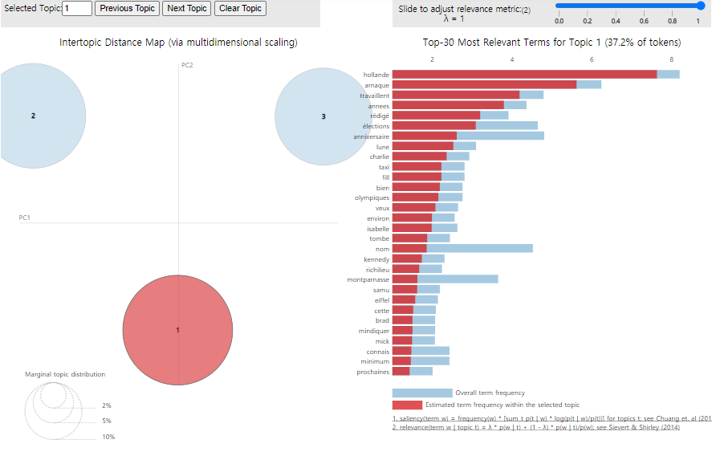

# DemoNLP : Voice recognition via NLP techniques

In this study, people freely asked a question to a voice recognition application. The application voice recognition sometimes failed, sometimes succeed.
In order to better target the topics which lead to a request failure, NLP techniques are used to gather the questions in several topics.

As an example a simple LDA is used.

Futurework: Relating the topics to the requests failure to compare the different clustering results in order to improve the voice regonition application.
